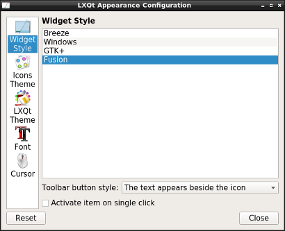
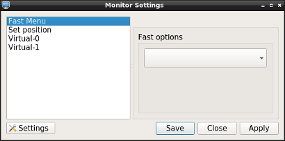
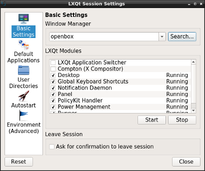
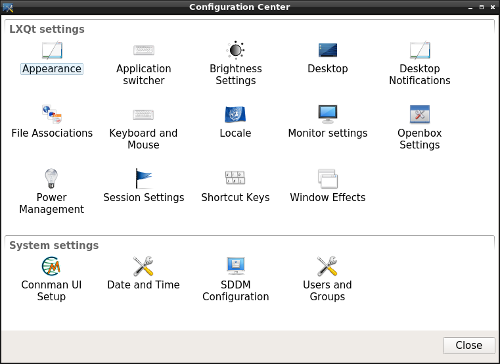

## lxqt-config

This repository is providing several tools involved in the configuration of both LXQt and the underlying operating
system.

It is comprising several tiny GUIs meant to configure a distinct functionality of LXQt that is stated in their title
bar and can be derived from the binary name as well.   
E. g. there's a GUI "LXQt Appearance Configuration", binary `lxqt-config-appearance`, that can be used to configure
the general appearance of LXQt, namely stuff like icon and LXQt theme or fonts.

The "Monitor Settings", binary `lxqt-config-monitor`, allow for adjusting screen resolutions, positioning of screens
and the likes.

In "LXQt Session Settings", binary `lxqt-config-session` topics affecting the LXQt session itself can be configured, e. g.
applications to be launched at the beginning or dedicated directories according to
[xdg-user-dirs](https://www.freedesktop.org/wiki/Software/xdg-user-dirs/).

The other main component is the so-called "Configuration Center", binary `lxqt-config`.   
It's a GUI hosting configuration tools like the ones mentioned above but not limited to those. Several other LXQt
components like [lxqt-notificationd](https://github.com/lxde/lxqt-notificationd) come with their own configuration GUIs
which are placed in the "Configuration Center" as well. [lxqt-admin](https://github.com/lxde/lxqt-admin) is providing tools
similar to those depicted above but meant to configure parts of the underlying OS. In fact any arbitrary application may
place its tools within the "Configuration Center". This can be seen in the following screenshot where it's featuring icon
"Connman UI Setup" which belongs to [cmst](https://github.com/andrew-bibb/cmst) and "SDDM Configuration" which belongs to
[sddm-config-editor](https://github.com/hagabaka/sddm-config-editor).

